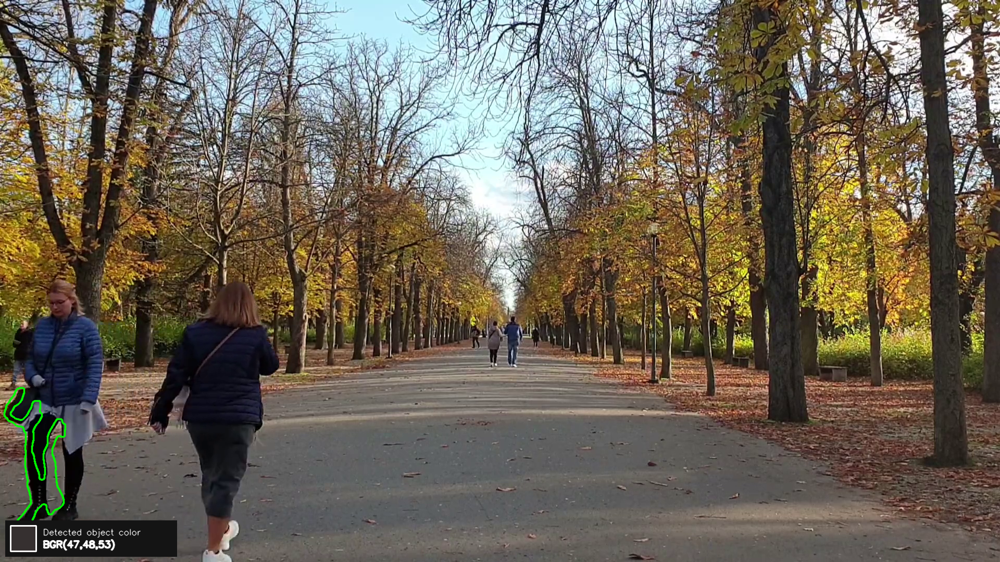
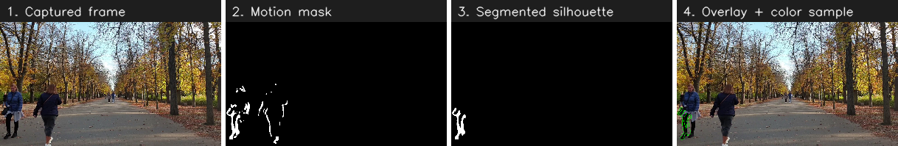

# module_pipe_project

A modular C++ processing pipeline showcasing interfaces, inheritance, templates, and RAII — built as an OpenCV vision pipeline: capture, motion detection, segmentation, and color analysis.

The project started as a simulated exercise (every module just logged a fake message) and has since been converted, module by module, into a real pipeline operating on real video frames.



*Real output from the pipeline running on `external/park.mp4`: `MovementDetector` flags the moving region, `SegmentationProcessor` outlines the person's precise silhouette (green), and `ColorProcessor` samples its average color (swatch, bottom-left).*

## Architecture

- **`IModule`** — the interface every pipeline stage implements: `run(FrameContext&)` and `name()`.
- **`FrameContext`** — a plain struct passed by reference through every module's `run()`. It's the shared state for one frame: the captured image, the motion mask/ROI/flag, and the segmented mask. Each module reads what earlier modules wrote and writes what later modules will read.
- **`Pipeline<ModuleT>`** — owns an ordered list of modules and runs them, taking `should_run`/`on_run` callables so the caller controls which modules run for a given frame (e.g. "only run segmentation if motion was found") without the pipeline itself knowing why.
- **`LoggerBase`** — a small timestamped logging mixin used by every module.

## Modules

| Module | What it does |
|---|---|
| `CameraSensor` | Wraps `cv::VideoCapture` (RAII: opens on construct, releases on destruct). Supports either a webcam index or a video file path. |
| `MovementDetector` | Frame-differencing motion detection (see [Motion detection strategy](#motion-detection-strategy)). |
| `SegmentationProcessor` | Refines the motion mask into a precise silhouette of the moving object via contours (see [Segmentation and color strategy](#segmentation-and-color-strategy)). Could later be swapped for an ONNX model via `cv::dnn` without changing anything downstream. |
| `ColorProcessor` | Computes the average color within the segmented silhouette only — not the whole frame. |

`main.cpp` runs these as a live loop: capture a frame, run detection/segmentation/color analysis (each gated by `should_run` on what the previous stages found), display it, repeat until the source is exhausted or Esc is pressed.

## Pipeline stages



1. **Captured frame** — straight from `CameraSensor`.
2. **Motion mask** — `MovementDetector`'s raw diff mask: every pixel that changed, however scattered.
3. **Segmented silhouette** — `SegmentationProcessor`'s refinement: just the single largest contour, filled and cleaned up.
4. **Overlay** — the segmentation contour drawn back onto the original frame, plus the color `ColorProcessor` sampled from it.

## Motion detection strategy

`MovementDetector` compares each frame to the previous one:

1. Convert to grayscale and blur (`GaussianBlur`, 21×21) — smooths out sensor/lighting noise before it can register as a false "changed" pixel.
2. `absdiff` against the previous (also blurred) grayscale frame.
3. `threshold` the difference — any pixel that changed by more than `kDiffThreshold` (25) counts as "changed".
4. `dilate` the result to merge nearby changed pixels into fewer, larger regions.

**Detection gate — why total changed pixels, not the largest contour:** the first version of this gated motion on the area of the *single largest contour* in the diff mask (a common pattern for "is there one clearly moving object"). Verified against a real test clip, that approach reported **zero** motion frames out of 367 — even in stretches where the video clearly had motion. The diff mask *did* light up (hundreds to ~4000 changed pixels in busy stretches), but as many small scattered regions rather than one solid blob, so no single contour ever crossed the area threshold.

The fix: gate on `cv::countNonZero(mask) >= kMinMotionPixels` (currently 200) — the *total* number of changed pixels, regardless of how they're distributed — and set the reported ROI to `cv::boundingRect(mask)`, the bounding box over every changed pixel (OpenCV's `boundingRect` accepts a mask directly and treats its nonzero pixels as a point set). Re-verified against the same clip: 253/367 frames correctly flagged as motion, tracking the video's actual quiet/active stretches.

This also cleanly splits responsibility from `SegmentationProcessor`: `MovementDetector` answers "did anything change, and roughly where" (cheap, coarse), while precise shape extraction via contours belongs to segmentation, which needs it for real.

## Segmentation and color strategy

`SegmentationProcessor` takes `MovementDetector`'s (often scattered) motion mask and narrows it down to one clean shape: `findContours` on the mask, keep only the single largest contour by area, fill it solid, then a morphological close (`MORPH_CLOSE`) to patch small internal holes without changing its overall size. `ColorProcessor` then computes `cv::mean(frame, segmentedMask)` — the average color *only* within that silhouette.

Both stages are deliberately gated externally, in `main.cpp`'s `should_run`, rather than checking internally — `SegmentationProcessor` only runs when `ctx.motionDetected`, `ColorProcessor` only when there's a real segmentation to sample from.

**A real bug this surfaced:** the first version gated `ColorProcessor` purely on `!ctx.segmentedMask.empty()`. But `ctx.segmentedMask` is only *written* when `SegmentationProcessor` actually runs — on a frame with no motion (so `SegmentationProcessor` gets skipped), the mask isn't cleared, it just keeps whatever it was from the last frame that *did* have motion. `ColorProcessor` was running anyway, sampling a stale silhouette against a completely unrelated current frame. Only caught by running the full compiled pipeline end-to-end against a video with genuine quiet stretches (`park.mp4`) — the earlier test clip almost always had motion, so it never exposed the gap. Fix: also gate on `ctx.motionDetected`, which `MovementDetector` recomputes fresh on every single tick, unlike `segmentedMask`.

## Building

Requires OpenCV (found via `find_package(OpenCV REQUIRED)` — developed against 4.6.0) and a C++20 compiler.

```
cmake -S . -B cmake-build-debug
cmake --build cmake-build-debug
```

## Test videos

This project has been developed under WSL2, which doesn't pass USB devices (like a laptop webcam) through to Linux by default — so `CameraSensor`'s webcam-index constructor won't find a device here. Two video files stand in for a live camera via `CameraSensor`'s video-file constructor:

- **`external/park.mp4`** (default, used by `main.cpp`) — people walking in a park. [Source: Pexels, "A Person Walking Down A Road In The Fall"](https://www.pexels.com/video/a-person-walking-down-a-road-in-the-fall-19341635/), free to use under the [Pexels License](https://www.pexels.com/license/).
- **`external/example.mp4`** — an aerial coastline clip used during earlier development (see the motion detection strategy notes above); kept as a secondary test asset.

Real webcam testing is expected to happen outside WSL (or via `usbipd-win` passthrough).